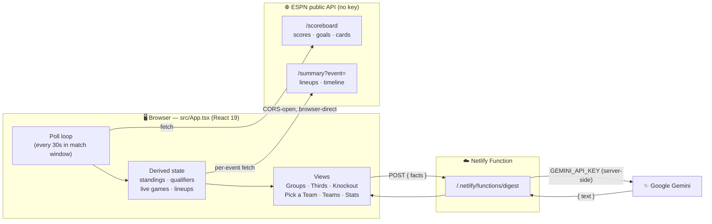
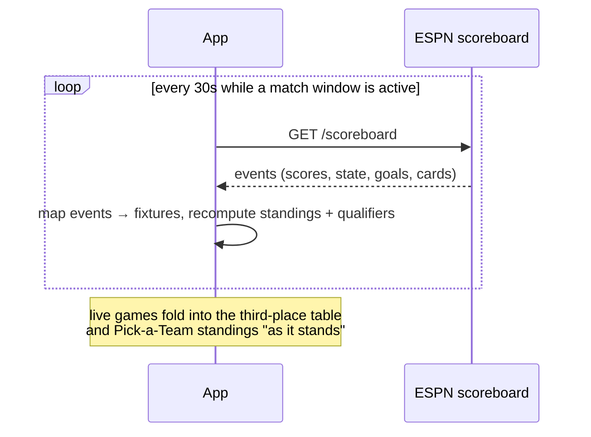
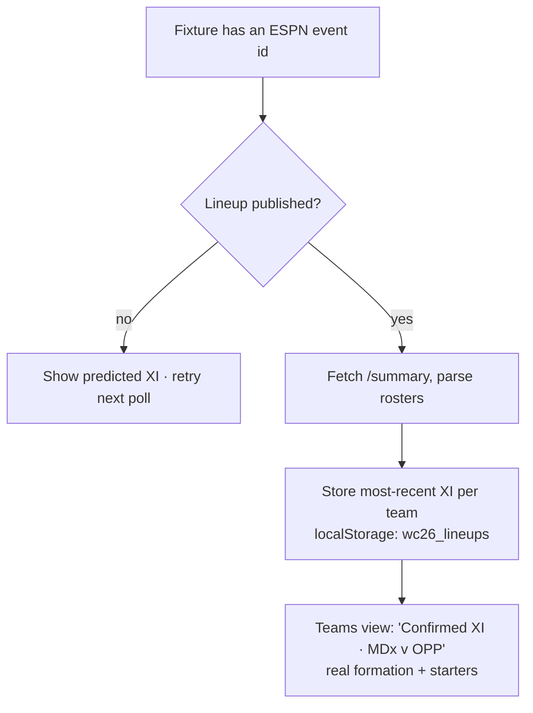

# ⚽ World Cup 2026 Live Tracker

A zero-config, auto-updating live tracker for the **2026 FIFA World Cup** — real scores,
standings, the new third-place wildcard race, a projected knockout bracket, team profiles
with **ESPN-confirmed lineups**, a "pick a team" path explorer, and an **AI daily digest**.
Everything updates automatically from public data. No manual score entry — this is a
**tracker, not a simulator**.

<!-- Git / shields.io badges -->
[](https://react.dev)
[](https://www.typescriptlang.org)
[](https://vite.dev)
[](https://www.netlify.com)
[](https://ai.google.dev)

[](https://github.com/kaimrdth/WC2026/commits)
[](https://github.com/kaimrdth/WC2026)
[](https://github.com/kaimrdth/WC2026)
[](#license)

---

## Table of contents

- [Features](#features)
- [How it works](#how-it-works)
- [Data sources](#data-sources)
- [The views](#the-views)
- [ESPN-confirmed lineups](#espn-confirmed-lineups)
- [AI daily digest](#ai-daily-digest)
- [Run locally](#run-locally)
- [Deploy](#deploy)
- [Project structure](#project-structure)
- [Tech stack](#tech-stack)
- [Caveats](#caveats)
- [License](#license)

---

## Features

| Area | What you get |
| --- | --- |
| 🟢 **Live scores** | Real results + in-progress games, auto-refreshing every 30s during match windows. A live-now banner links straight to the match. |
| 📊 **Group standings** | All 12 groups, computed from real results, sortable, with qualification highlighting. |
| 🎟️ **Third-place table** | The 2026 best-8-thirds wildcard race — **"as it stands,"** folding in live scores so the cutoff line moves in real time. |
| 🏆 **Knockout bracket** | Projected from current standings until real KO games begin, then fills in with results. |
| 🧭 **Pick a Team** | Trace any team's road to the final — reflects standings *right now* (incl. live games), and lets you swap in hypothetical **what-if** opponents. |
| 👕 **Team profiles** | Squad, formation, narrative, captain — with the **last ESPN-confirmed XI** shown once a team has played. |
| 📋 **Match detail** | Per-match lineups, formations, and a parsed goal/card/sub timeline. |
| 🤖 **AI daily digest** | A short, narrated briefing of the day — today's games, or a recap of the last matchday plus what's next. |
| 📈 **Stats** | Top scorers, cards, and tournament tallies derived from the live feed. |

---

## How it works

The entire client is a **single-file React app** (`src/App.tsx`). It fetches public,
keyless ESPN endpoints directly from the browser, derives everything (standings,
qualifiers, projections) on the client, and calls **one Netlify function** for the AI
digest so the Gemini key never reaches the browser.



**Key idea:** the app stores no scores of its own. It reads the truth from ESPN, recomputes
standings and projections locally, and persists only two things to `localStorage` — the
last ESPN-confirmed lineups and the cached daily digest.

---

## Data sources

- **Scores · standings · stats · live games · lineups** come from ESPN's public,
  keyless `fifa.world` **scoreboard** and **summary** endpoints (CORS-open), fetched
  directly in the browser.
- The poll loop runs on launch, then **every 30s while a match window is active** (a
  fixture's kickoff ±~2.5h) — so there's no network chatter when nothing is on.
- Group fixtures (matchups, matchdays, dates, venues) are **baked into `src/App.tsx`** —
  the real 2026 schedule.
- Knockout is a **projection** from current standings until real KO games begin
  (June 28, 2026); it then shows real results as they come in.



---

## The views

| Nav item | What it shows |
| --- | --- |
| **Groups** | 12 group tables + a per-group fixture list with live/finished cards. |
| **Third Place Table** | All 12 third-placed teams ranked; the top 8 advance. Updates live ("as it stands"). |
| **Knockout** | The R32→Final bracket, projected then real. |
| **Pick a Team** | Choose a team → see its projected path; toggle win-group vs runner-up; pick what-if opponents. |
| **Stats** | Scorers, cards, tournament tallies. |
| **Teams** | All 48 teams: profile, formation, narrative, captain, and confirmed/predicted XI. |

---

## ESPN-confirmed lineups

Team XIs in the data are **predictions** until a team actually plays. Rather than label a
prediction "Confirmed," the app pulls each team's **real published lineup** from ESPN's
per-match summary endpoint and shows the **most recent confirmed XI** in the Teams view
(and pre-match preview). The badge only reads **"Confirmed XI"** when the data is genuinely
ESPN-sourced; otherwise it reads **"Predicted XI."**



Confirmed lineups and the set of already-fetched events persist across reloads, so a
team's last confirmed XI survives between match windows and completed matches aren't
re-fetched.

---

## AI daily digest

A short, narrated briefing at the top of the app, generated by **Gemini** from the current
tournament state. The API key **never** touches the client — it lives in a Netlify
function that proxies the request.

**Content logic** picks its own focus:
- **Games today** (live, finished, or upcoming) → leads with them and what's at stake.
- **No games today** → recaps the most recent matchday's results, then previews what's next.

### Rate-limit defenses

Gemini's free tier limits **requests per minute**, and a naive "every browser calls the
model" design trips it the moment a few people open the app at once. The digest is layered
to keep calls to a minimum and never show a failure when it can avoid one:

| Layer | What it does | Why it matters |
| --- | --- | --- |
| **L0 · browser cache** (`localStorage`) | Repeat load with unchanged state never hits the network | Reloads are free |
| **Facts-hash key** | Hash ignores the ticking match clock (`44'` vs `45'`) | A live game that only advanced the clock doesn't regenerate |
| **L1 · server memory** | Warm function instance caches by facts-hash | Bursts to one instance dedupe instantly |
| **L2 · Netlify Blobs** | Durable, **shared** cache across all visitors + instances | N visitors on the same state → **one** Gemini call, globally |
| **Request coalescing** | Concurrent identical requests await a single in-flight call | Simultaneous loads can't fan out into N calls |
| **Stale-on-failure** | On a rate limit/error, serve the last good digest (`stale`) | Users see content, not an error or a blank panel |
| **Model fallback + `Retry-After`** | `2.5-flash` → `2.0-flash`; passes Gemini's backoff hint through | Absorbs transient overload; client backs off correctly |

Net effect: a 5-person burst that would have been 5 model calls collapses to **1**, and an
actual rate limit degrades to a slightly-stale digest instead of a visible failure. (A raw
`429` only reaches the browser when nothing is cached anywhere — and the panel then hides
rather than showing an error.)

```mermaid
sequenceDiagram
    participant UI as DigestPanel
    participant LS as localStorage (L0)
    participant Fn as Netlify function
    participant Mem as memory (L1)
    participant Blob as Netlify Blobs (L2)
    participant G as Gemini

    UI->>UI: buildDigestFacts(results, liveGames)
    UI->>LS: lookup by facts-hash
    alt L0 hit (this browser, unchanged state)
        LS-->>UI: cached digest (no network)
    else L0 miss
        UI->>Fn: POST { facts }
        Fn->>Mem: hash(facts) lookup
        alt L1 hit
            Mem-->>UI: { text, cached:"mem" }
        else L1 miss
            Fn->>Blob: shared lookup
            alt L2 hit (another visitor already generated it)
                Blob-->>UI: { text, cached:"blob" }
            else L2 miss
                Fn->>G: prompt (key server-side, coalesced, model fallback)
                alt success
                    G-->>Fn: { text }
                    Fn->>Mem: store
                    Fn->>Blob: store + update "latest"
                    Fn-->>UI: { text }
                    UI->>LS: store by facts-hash
                else rate-limited / error
                    Blob-->>Fn: last good ("latest")
                    Fn-->>UI: { text, stale:true }
                end
            end
        end
    end
```



The model only narrates the facts it's given — it never invents scores, scorers, or
fixtures. The model, prompt, and caching live in `netlify/functions/digest.mjs`; the
durable shared cache uses **Netlify Blobs** (auto-configured in the Netlify runtime, and
the function degrades to memory-only if it's ever unavailable).

---

## Run locally

```bash
npm install
npm run dev            # http://localhost:5173 — scores, standings, stats, lineups all work
```

> Under plain `npm run dev` the digest **function** isn't served, so the digest panel shows
> a friendly error/loading state. Everything else works fully.

To run the app **and** the digest function together:

```bash
npm i -g netlify-cli                          # if needed
echo "GEMINI_API_KEY=your_key_here" > .env    # gitignored — do NOT commit
netlify dev                                   # serves the app + the function locally
```

Other scripts:

```bash
npm run build       # type-check (tsc -b) + static build into dist/
npm run preview     # preview the production build
npm run typecheck   # types only, no emit
```

---

## Deploy

Hosted on **Netlify** (config in `netlify.toml`, all preset):

| Setting | Value |
| --- | --- |
| Base directory | `worldcup-2026-standalone` |
| Build command | `npm run build` |
| Publish directory | `dist` |
| Functions directory | `netlify/functions` |
| Node version | `22` |

**One required env var:** set `GEMINI_API_KEY` in **Site settings → Environment variables**
for the digest. Everything else is keyless.

---

## Project structure

```
worldcup-2026-standalone/
├── index.html               # Vite entry
├── src/
│   ├── App.tsx              # the entire app: data, logic, views, inline CSS
│   └── main.tsx             # React root
├── netlify/
│   └── functions/
│       └── digest.mjs       # Gemini proxy (key stays server-side; retries + model fallback)
├── netlify.toml             # build + functions config
├── vite.config.ts
└── package.json
```

> `src/App.tsx` is intentionally a single file — data tables, ESPN fetchers, standings/
> qualifier math, every view component, and the styles all live together for easy grokking.

---

## Tech stack

- **React 19** + **TypeScript 5.9** (strict)
- **Vite 7** build
- **lucide-react** icons
- **Netlify Functions** (serverless) for the AI proxy, with **Netlify Blobs** as the shared digest cache
- **Google Gemini** for the daily digest
- **ESPN public API** for all match data (no key, CORS-open)

---

## Caveats

- Match data depends on ESPN's public endpoints; if they change or rate-limit, the feed
  degrades gracefully (the UI shows "feed unavailable" rather than breaking).
- Knockout opponents are **projected** (by FIFA seeding/ratings) until the real bracket
  fills in; projected steps are clearly labeled.
- The R32 "best third-placed" slots resolve once enough groups finish; until then those
  specific opponents read as TBD.
- The digest needs `GEMINI_API_KEY`; without it the panel surfaces a clear error.

---

## License

No license file is present yet, so the project is **"all rights reserved"** by default —
others can view the code but have no granted rights to use, copy, or distribute it. If you
want it to be open source, add a `LICENSE` file (MIT is a common permissive choice) and
update the badge above.
